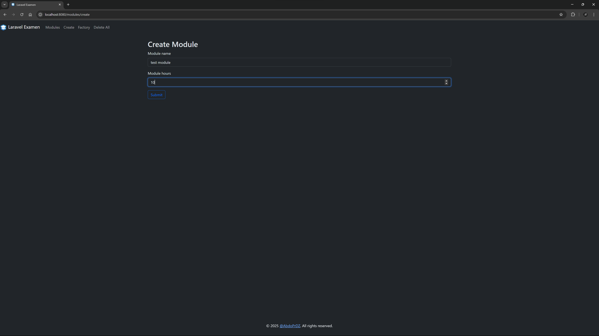

# Laravel CRUD Project for Managing Modules

This is a simple Laravel project to manage modules. The project includes functionality to create, read, update, and delete (CRUD) modules with attributes such as name and hours.

## Features

- **Index Page**: Displays a table of all modules.
- **Create/Edit Page**: Allows users to create a new module or edit an existing one.
- **Factory button**: Generate a fake modules.
- **Delete all button**: Delete all modules items.

## Requirements

- PHP >= 8.x
- Composer
- Laravel >= 10.x
- MySQL
- NodeJs => 22.x

## Installation

1. Clone the repository:

```bash
git clone https://github.com/yourusername/laravel_examen.git
cd laravel_examen
```

2. Install dependencies:

```bash
composer install
```

3. Copy the `.env.example` file to `.env` and configure your database settings:

```bash
cp .env.example .env
```

4. Generate an application key:

```bash
php artisan key:generate
```

5. Run the database migrations:

```bash
php artisan migrate
```

6. Serve the application:

```bash
php artisan serve
```

## Usage

- Navigate to `http://localhost:8000` to access the application.
- Use the index page to view all modules.
- Use the create/edit page to add a new module or edit an existing one.

## Routes

- **GET /modules**: Display the list of modules.
- **GET /modules/create**: Show the form to create a new module.
- **POST /modules**: Store a new module.
- **GET /modules/{id}/edit**: Show the form to edit an existing module.
- **POST /modules/{id}**: Update an existing module.
- **GET /modules/{id}**: Delete a module.
- **GET /modules/delete**: Delete all modules.
- **GET /modules/factory**: Generate a fake modules.

## Screenshots

## Screenshots

Here are some screenshots of the application:

<div style="display: grid; grid-template-columns: repeat(2, 1fr); gap: 10px;">
  
  
  
  
</div>

## License

This project is open-source and available under the [MIT License](LICENSE.md).

## Contributing

Contributions are welcome! Please open an issue or submit a pull request for any changes.

## Contact

For any questions or inquiries, please contact us via [abdopr47@gmail.com](mailto:abdopr47@gmail.com), [WhatsApp](https://wa.me/213778185797), [Telegram](https://t.me/abdoprdz) or call us at +213778185797.
